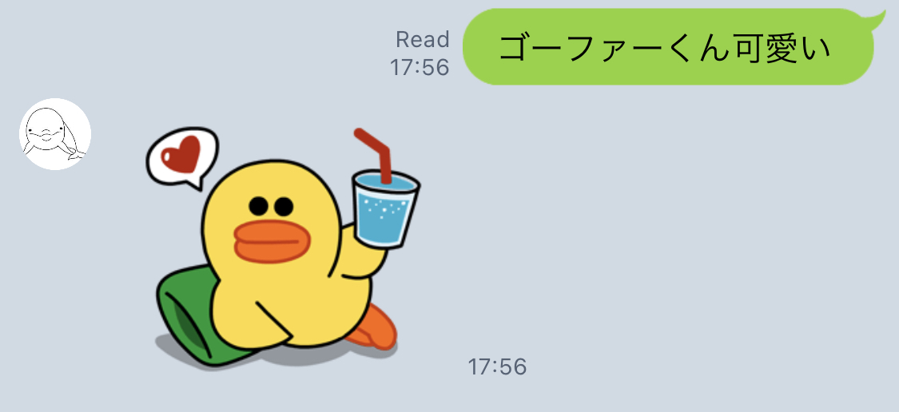

# Go - Line Bot Log

簡単に日々を記録できるLine Botです。

## 機能

1. たまに調子を聞いてくれる
    
    
    
    
    
2. メッセージを送信すると保存してくれる
    
    
    
3. 「★履歴★」を送信すると今までのログが見れる
    
    
    

## 使い方

1. Line DevelopersからMessaging APIを準備
    1. 対象のAPIのChannel secretとChannel access tokenを手に入れる
2. Herokuのアカウントを用意してデプロイ
3. Line DevelopersからWebhookの設定を行う